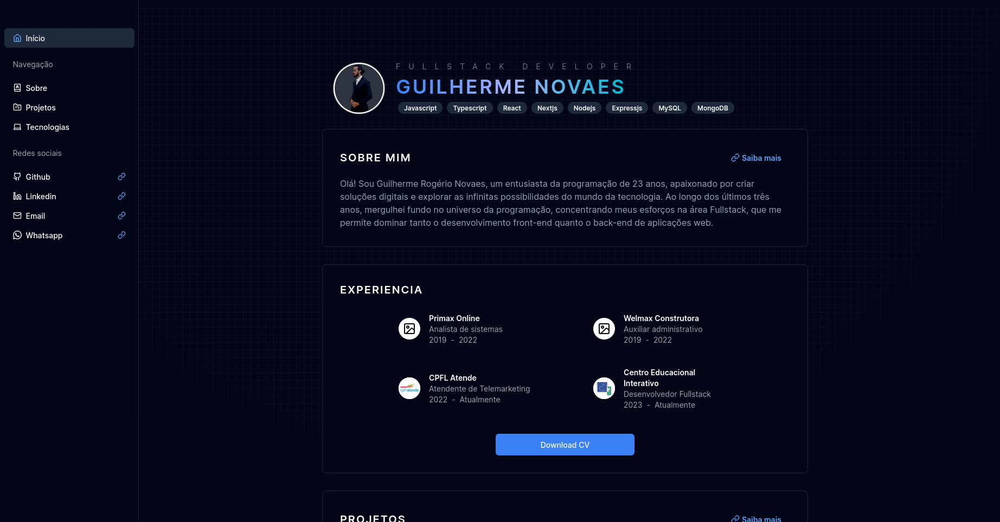
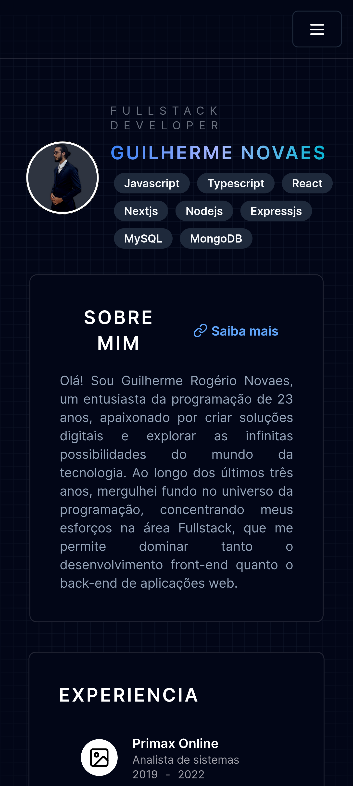

# Personal portifolio

This is the actual version of my personal portfolio.

## Index

- [General](#general)
  - [Screenshot](#screenshot)
  - [Links](#links)
  - [Stack](#stack)
- [Author](#author)

## General

### Screenshot
                 Desktop                 |                 Mobile
:---------------------------------------:|:--------------------------------------:
  |  

### Links

- Production: [Visualize](https://guilherme-rnovaes.github.io/)

### Stack

- Typescript
- NextJs
- TailwindCss
- Framer Motion

## Author

- Portifolio - [Guilherme Rogério Novaes](https://guilherme-novaes-portifolio.vercel.app/)
- LinkedIn - [Guilherme Rogério Novaes](https://www.linkedin.com/in/guilherme-r-novaes/)
- GitHub - [Guilherme-RNovaes](https://github.com/Guilherme-RNovaes)
